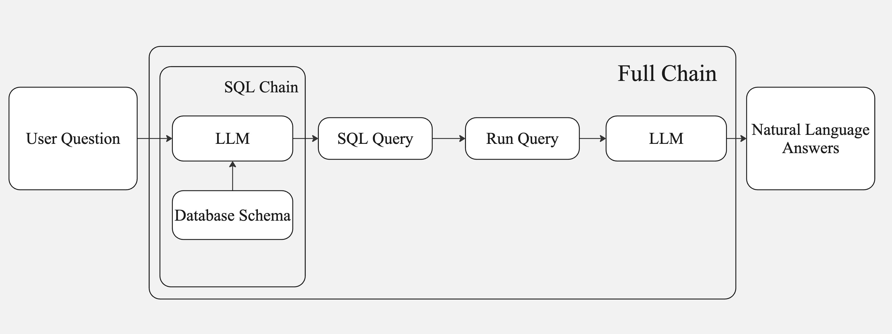

# 🧠 SQL-Based Question Answering System

## 🚀 **Architecture Overview**

The following diagram illustrates the system's flow:

### 🔍 **Workflow Description**

1. **User Question**: The system starts by accepting a natural language query from the user.

2. **SQL Chain**: 
   - The user query is processed by an **LLM** that references the **Database Schema** to construct an accurate SQL query.
   - The generated **SQL Query** is then forwarded for execution.

3. **Query Execution**: The constructed SQL query is executed to fetch relevant data from the database.

4. **Answer Generation**: The retrieved data is processed by another **LLM** to generate a natural language response for improved user understanding.

5. **Final Output**: The final answer is presented back to the user in clear and concise language.

