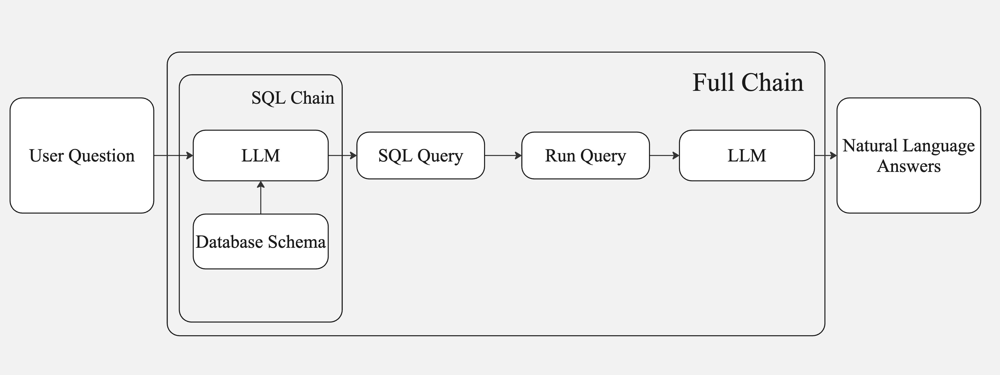

# 🧠 SQL-Based Question Answering System

This project leverages GPT-4 to handle intuitive natural language queries, generate SQL queries dynamically, and interact with SQL databases. It's designed to offer a user-friendly interface powered by **Streamlit** and developed in **Python**.

## Features

- **✅ Intuitive Query Handling**: 
  Leverages GPT-4 to understand and respond to user queries in natural language.
  
- **✅ Dynamic SQL Generation**: 
  Automatically constructs SQL queries based on the user's natural language input.
  
- **✅ Seamless Database Integration**: 
  Establishes connections with SQL databases to efficiently fetch query results.
  
- **✅ Interactive Interface**: 
  Built with **Streamlit** to provide a simple and user-friendly experience for users of all skill levels.
  
- **✅ Python-Powered**: 
  Developed entirely in **Python**, following modern coding practices for enhanced readability and maintainability.
  
## 🚀 **Architecture Overview**

The following diagram illustrates the system's flow:

### 🔍 **Workflow Description**

1. **User Question**: The system starts by accepting a natural language query from the user.

2. **SQL Chain**: 
   - The user query is processed by an **LLM** that references the **Database Schema** to construct an accurate SQL query.
   - The generated **SQL Query** is then forwarded for execution.

3. **Query Execution**: The constructed SQL query is executed to fetch relevant data from the database.

4. **Answer Generation**: The retrieved data is processed by another **LLM** to generate a natural language response for improved user understanding.

5. **Final Output**: The final answer is presented back to the user in clear and concise language.

